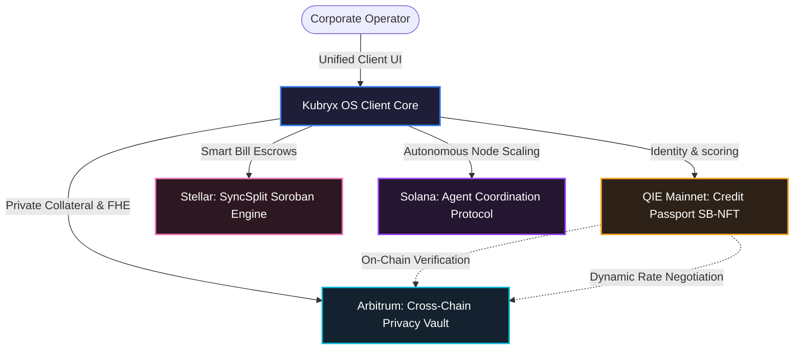

# Kubryx

One financial OS for Web3. Eight powerful tools — credit scoring, inheritance vaults, private trading, DeFi lending, treasury automation, AI agents, split payments, and a unified dashboard — across four chains.

**Live app: https://kubryx.vercel.app**

> This is a production deployment. Use the live app above — local setup is not supported and the infrastructure is private.

---

## System Architecture

---

## Premium Feature Guide & Technical Handbook

Below is an in-depth breakdown of each dashboard in the Kubryx ecosystem—detailing its purpose, why users use it, why it is efficient, and why it represents the best in modern Web3 application development.

### 1. Yield Operations Hub (Treasury)
- **What it is for**: An enterprise-grade treasury console to track multi-chain liquidity, manage payroll streams, perform token swaps, and optimize yield strategies across EVM, SVM, and Stellar.
- **Why users use it**: Unifies fragmented corporate balances into a single dashboard. Instead of logging into dozens of cross-chain dApps, operators manage assets in one place with dark glassmorphic styling, high-contrast metrics, and active recommendation feeds.
- **Why it is efficient**: Employs client-side caching to bypass network RPC rate limits. Dynamic font scaling keeps large numbers (like block numbers or yield metrics) strictly inside card boundaries.
- **Why it is the best**: It is an active cockpit rather than a passive dashboard. Built-in AI advisors suggest rebalancing allocations that can be executed in one click.

### 2. Cross-Chain Privacy Vault
- **What it is for**: A private trading and asset custody terminal where users deposit collateral (BTC, ETH, SOL) into Arbitrum smart contracts, register MPC-secured dWallets, and execute private FHE-encrypted trades.
- **Why users use it**: Allows institutions to hedge positions or move capital without leaking trade strategies, transaction metadata, or size details to front-running MEV bots and competitors.
- **Why it is efficient**: Uses client-side PBKDF2 to secure keys before anchoring references. An inverted styling theme visually isolates the high-security sandboxed state.
- **Why it is the best**: Replaces simple, single-use privacy pools with a multi-purpose execution workspace that handles custody, MPC generation, and private trading in a single flow.

### 3. Credit Passport
- **What it is for**: A reputation scoring registry that aggregates a user's cross-chain history to mint a Soulbound NFT (SB-NFT) on QIE Mainnet representing their credit score.
- **Why users use it**: Overcomes the Web3 requirement for heavy over-collateralization by allowing users to leverage their historical on-chain reputation to qualify for better lending terms.
- **Why it is efficient**: Computes score projections locally prior to dispatching transactions to save gas. Dynamic color-coded tiers (Bronze, Silver, Gold) change dynamically based on the score.
- **Why it is the best**: It actively boosts user utility across other modules—lowering lending rates in the Borrow Engine, increasing LTV limits in the Privacy Vault, and raising queue priority in the Treasury.

### 4. AI-Negotiated Lending (Lendora)
- **What it is for**: An interactive DeFi lending market on Arbitrum where users chat with an AI agent to negotiate interest rates, terms, and collateral limits.
- **Why users use it**: Replaces rigid, algorithmically fixed rate curves with flexible negotiations. The AI reads the user's Credit Passport NFT on QIE Mainnet to customize rate proposals dynamically.
- **Why it is efficient**: Conversations are managed off-chain for zero-latency interactions, while the finalized agreement envelope is cryptographically signed and settled on-chain.
- **Why it is the best**: Bridges conversational AI with smart contract execution. Users do not need to fill out complex forms; they negotiate naturally and sign the transaction to finalize terms.

### 5. SyncSplit (Stellar Soroban Escrow)
- **What it is for**: A expense-sharing and bill-splitting terminal utilizing Soroban smart contracts on the Stellar testnet to handle multi-party escrows.
- **Why users use it**: Replaces trust-based split-payment apps with on-chain guarantees. Funds are deposited into a secure Soroban escrow contract and released automatically once all shares are settled.
- **Why it is efficient**: Leverages a fast multi-phase pipeline (Escrow Generation -> Stellar Anchoring -> Verification) and caches node telemetry to present sub-second page updates.
- **Why it is the best**: Resolves multi-party payment coordination with cryptographic certainty, featuring wallet address truncation and real-time status notifications.

### 6. Stealth Executive Suite (Shadow Sandbox)
- **What it is for**: A sandboxed Digital Twin simulation cockpit designed to replicate the live node and treasury environment. Risk managers can simulate RPC congestions, regional server outtages, and malicious fee drains.
- **Why users use it**: Enables corporate risk teams to test emergency failover scripts and verify automated security policies in a safe sandbox before committing real funds.
- **Why it is efficient**: Synchronizes active workspace state directly into client memory, requiring zero test transactions or gas fees to run scenarios.
- **Why it is the best**: Brings professional stress-testing to the visual UI layer. Executives can trigger attacks and monitor self-healing telemetry in real-time.

### 7. Agent Coordination Protocol
- **What it is for**: An orchestration panel on Solana to deploy, coordinate, and scale specialized AI agent nodes (Yield Sovereign, Governance Chancellor, Infrastructure Sentinel).
- **Why users use it**: Provides operational visibility over automated AI nodes, showing active task status, execution slots, and consensus alignment metrics.
- **Why it is efficient**: Displays real-time Solana slot updates to maintain alignment and streams log telemetry asynchronously to prevent page lag.
- **Why it is the best**: Implements Explainable AI (XAI) standards. Every transaction proposal generated by an agent leaves a zero-knowledge policy trace explaining which constraint authorized the trade.

---

## Tools & Chains

| Tool | Route | Target Network | Key Technology |
| :--- | :--- | :--- | :--- |
| **Credit Passport** | `/credit` | QIE Mainnet | Soulbound NFT Reputation Scoring |
| **Family Vault** | `/legacy` | QIE Mainnet | AES-GCM-256 Client-side Memory Vault |
| **Bill Split** | `/split` | Stellar Testnet | Soroban Escrow Smart Contracts |
| **Protocol Borrow Engine** | `/lend` | Arbitrum | conversational AI Term Negotiation |
| **Agent Co-ordinator** | `/agents` | Solana Devnet | Zero-Knowledge explainability traces |
| **Stealth Execution Suite** | `/shadow` | Solana Devnet | Digital Twin simulated sandboxing |
| **Yield Operations Hub** | `/treasury` | Solana Devnet | Unified multi-chain reactive event bus |
| **Private Vault** | `/vault` | Multi-chain | MPC dWallets & FHE Private Trading |

---

## Wallets

- **MetaMask** — QIE Mainnet, Arbitrum, Ethereum
- **Phantom** — Solana Devnet
- **Freighter** — Stellar Testnet

*Every tool works in demo mode without a wallet connected.*

---

## Tech Stack

- **Frontend**: Next.js 16, TypeScript, Tailwind v4, Vanilla CSS
- **Backends**: 7 microservices deployed on Render
- **Wallets**: MetaMask, Phantom, Freighter
- **AI Engine**: Groq LLaMA-3.3-70B-Versatile
- **Deployment**: Vercel (frontend), Render (backends)

---

## Not intended for local development

The backend services, API keys, database, RPC endpoints, and infrastructure are private and managed by the maintainer. There is no supported path to run this project locally.

If you want to explore the code, browse the source in this repository. If you want to use the product, go to https://kubryx.vercel.app.

---

## License & Attribution

This platform — including source code, architecture, infrastructure, backend systems, frontend, APIs, databases, UI/UX, and production workflows — was independently designed and built by **vsrupeshkumar**.

- **Founder & Developer:** vsrupeshkumar
- **License:** Apache License 2.0

All rights reserved.
