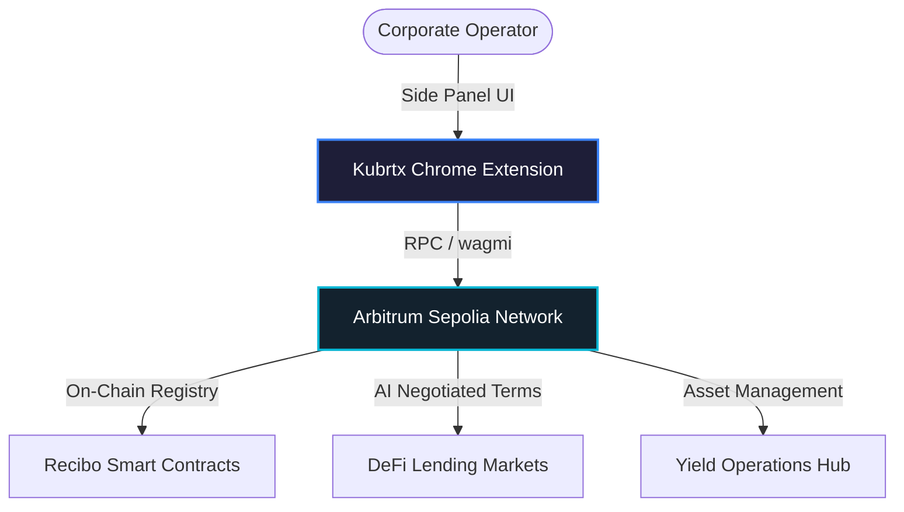

# Kubrtx OS

**Ethereum Mexico 2026 - AI x Blockchain | w/ Bitso Hackathon Submission**

One financial OS for Web3, built as a zero-redirection **Chrome Extension Single Page Application (SPA)**. Eight powerful tools — including 100% on-chain invoicing, private trading, DeFi lending, treasury automation, AI agents, split payments, and a unified dashboard — all deployed exclusively on **Arbitrum**.

---

## Hackathon Context

This project was built for the **Ethereum Mexico 2026 Hackathon**. 
- **Core Requirement:** All features and modules run 100% on **Arbitrum** (Arbitrum Sepolia for testnet).
- **Architecture Requirement:** Fully accessible directly through a browser extension without navigating to separate web pages (SPA Side Panel architecture).
- **No Off-chain Databases:** All data, including invoice metadata and payment statuses, are stored directly on-chain via smart contracts using OpenZeppelin libraries.

---

## System Architecture

---

## Premium Feature Guide

### 1. 100% On-Chain Invoicing (Recibo)
- **What it is:** A decentralized invoicing tool that stores all invoice metadata (client, amount, due date) directly on Arbitrum smart contracts.
- **Why it is efficient:** Eliminates off-chain databases. Uses `wagmi` to read and write structs directly to the blockchain. Users can pay invoices with USDC in a single transaction.

### 2. Yield Operations Hub (Treasury)
- **What it is:** An enterprise-grade treasury console to track Arbitrum liquidity, manage payroll streams, perform token swaps, and optimize yield strategies.
- **Why it is the best:** It is an active cockpit rather than a passive dashboard. Built-in AI advisors suggest rebalancing allocations that can be executed in one click.

### 3. AI-Negotiated Lending (Lendora)
- **What it is:** An interactive DeFi lending market where users chat with an AI agent to negotiate interest rates, terms, and collateral limits.
- **Why it is efficient:** Conversations are managed off-chain for zero-latency interactions, while the finalized agreement envelope is cryptographically signed and settled on Arbitrum.

### 4. Stealth Executive Suite (Shadow Sandbox)
- **What it is:** A sandboxed simulation cockpit designed to replicate the live node and treasury environment to test risk management.

---

## Extension Installation (Local Testing)

Since this is a Chrome Extension SPA, you can install it locally to test the Side Panel integration:

1. Clone the repository and install dependencies (`npm install`).
2. Build the Next.js frontend or run it locally (`npm run dev`).
3. Open Chrome and navigate to `chrome://extensions/`.
4. Enable **Developer mode** in the top right corner.
5. Click **Load unpacked** and select the `chrome-extension/` directory in this repository.
6. Click the extension icon in your browser to open the Kubrtx Side Panel.

---

## Tech Stack

- **Frontend**: Next.js 16, TypeScript, Tailwind v4, Vanilla CSS
- **Extension Wrapper**: Chrome Side Panel API, Hash Routing
- **Smart Contracts**: Solidity ^0.8.20, Hardhat, OpenZeppelin
- **Web3 Integration**: Wagmi, Viem, RainbowKit
- **AI Engine**: Groq LLaMA-3.3-70B-Versatile

---

## License & Attribution

This platform — including source code, architecture, infrastructure, backend systems, frontend, APIs, databases, UI/UX, and production workflows — was independently designed and built by **vsrupeshkumar**.

- **Founder & Developer:** vsrupeshkumar
- **License:** Apache License 2.0

All rights reserved.
