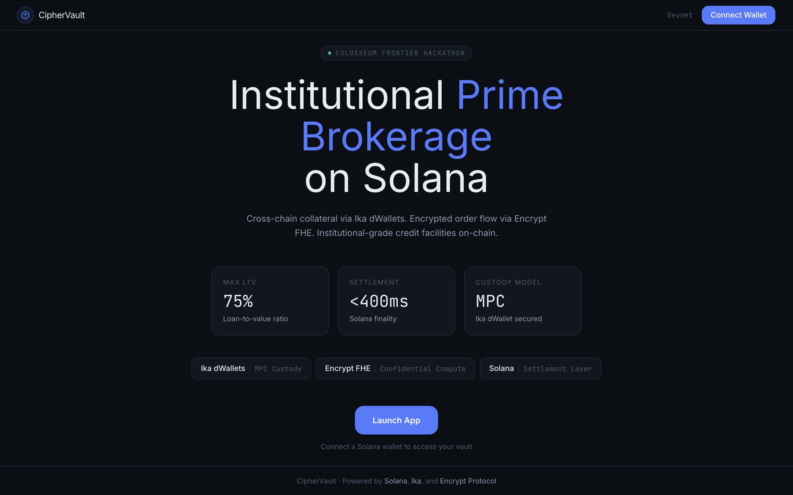
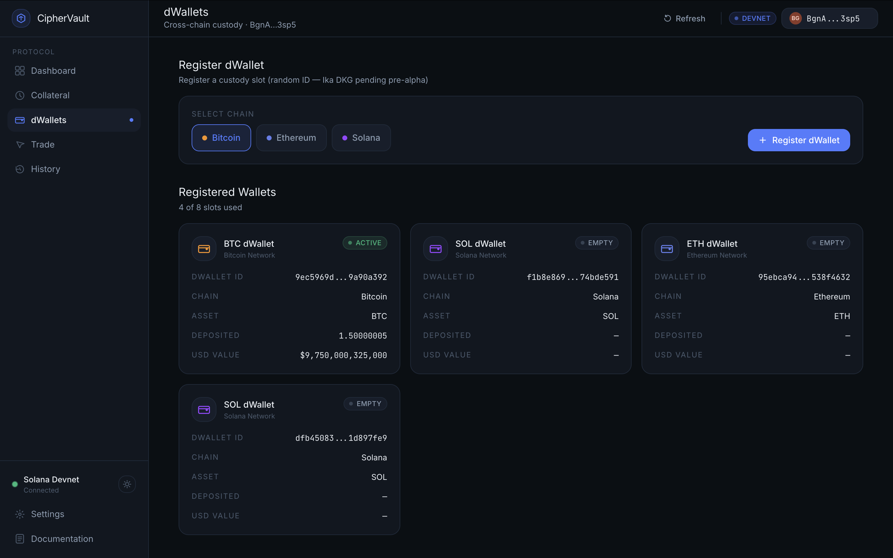
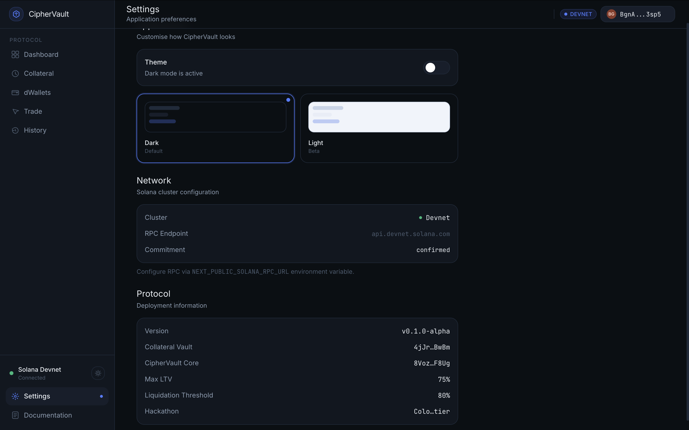
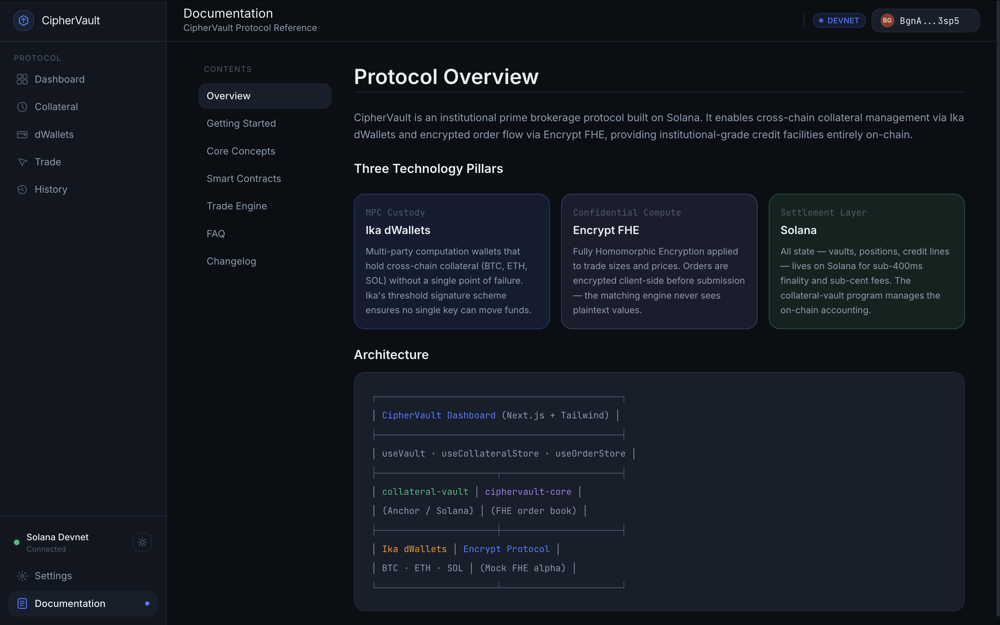
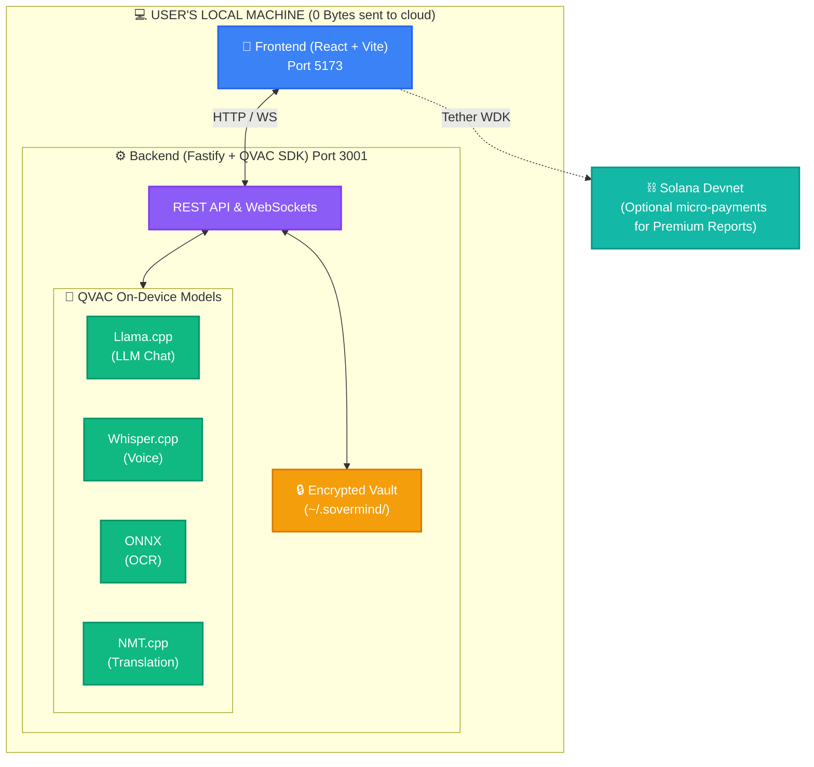
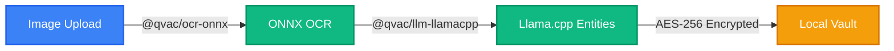

<div align="center">
  <br />
  <h1>SOVERMIND</h1>
  <p>
    <strong>Private. Offline. Sovereign. A local-first AI health companion that runs entirely on your device.</strong>
  </p>
  
  <p>
    <a href="https://sovermind-app.vercel.app/"></a>
    <a href="https://explorer.solana.com/address/Gyk1UsWrmo2W3p4LGTyyFbsXCWwsocKVc8X3tdDaJXJ4?cluster=devnet"></a>
    <a href="https://qvac.tether.io"></a>
  </p>

  <p>
    
    
    
    
    
    
  </p>
  <br />
</div>

> **SOVERMIND** is a local-first AI health companion that brings advanced medical inferences—chat, OCR, voice transcription, and translation—directly to your machine. Zero bytes are sent to the cloud. Featuring Solana micro-payments for premium reports and Tether's robust QVAC SDK. This is health privacy meets absolute digital sovereignty.

<div align="center">
  
</div>

---

## Table of Contents

- [Live Deployment](#live-deployment)
- [Screenshots](#screenshots)
- [System Architecture](#system-architecture)
- [Pipeline Architecture](#pipeline-architecture)
- [Protocol Features](#protocol-features)
- [Technology Stack](#technology-stack)
- [Quick Start](#quick-start)
- [Privacy Guarantees](#privacy-guarantees)
- [Project Structure](#project-structure)

---

## Live Deployment

| Component | URL | Status |
|:---|:---|:---:|
| **Frontend App** | [sovermind-app.vercel.app](https://sovermind-app.vercel.app/) | Live Demo |
| **Solana Program** | [`Gyk1UsWrmo2W3p4LGTyyFbsXCWwsocKVc8X3tdDaJXJ4`](https://explorer.solana.com/address/Gyk1UsWrmo2W3p4LGTyyFbsXCWwsocKVc8X3tdDaJXJ4?cluster=devnet) | Deployed |
| **Network** | Solana Devnet | Active |

---

## Screenshots

<table>
  <tr>
    <td align="center"><b>Health Monitor — AI Chat</b></td>
    <td align="center"><b>Prescription Scan</b></td>
  </tr>
  <tr>
    <td></td>
    <td></td>
  </tr>
  <tr>
    <td align="center" colspan="2"><b>Health Analysis & Vault</b></td>
  </tr>
  <tr>
    <td colspan="2"></td>
  </tr>
</table>

---

## System Architecture

SoverMind operates entirely on your machine. The frontend UI communicates with a local backend that directly orchestrates Tether's QVAC SDK for AI inference. No health data ever leaves your device.



---

## Pipeline Architecture

SoverMind uses four QVAC capabilities in a single end-to-end pipeline. Every step runs locally. The byte counter in the header is hardcoded to `0` because no network calls are ever made.

### 🎙️ Voice & Multilingual Chat


### 📄 Prescription OCR & Vault


---

## Protocol Features

| Feature | Description |
|:---|:---|
| **AI Health Chat** | Ask health questions — Llama.cpp answers locally, streaming token by token |
| **Voice Input** | Speak your query in any language, transcribed on-device via Whisper.cpp |
| **Prescription OCR** | Photograph a prescription — medicines extracted and explained using ONNX |
| **Multilingual Output** | Responses translated to Tamil, Hindi, Swahili offline using NMT.cpp |
| **Encrypted Vault** | Entries encrypted with AES-256-GCM using a key derived from your machine ID |
| **Premium Reports** | Optional Solana Devnet flow (Tether WDK) to pay 0.50 USDT for signed PDF reports |

---

## Technology Stack

| Layer | Technology | Function |
|:---|:---|:---|
| **Frontend** | React 18 (Vite) | High-performance VDOM rendering |
| **Styling** | Tailwind CSS | Modern layout and aesthetics |
| **Backend** | Fastify v4 (Node.js) | High-performance API and WebSockets |
| **AI Core** | Tether QVAC SDK | Local orchestration of Llama, Whisper, ONNX, NMT |
| **State** | Zustand | Global application state management |
| **Web3** | Solana / Anchor | Optional micro-payments and signed hash storage |
| **Web3 SDK** | Tether WDK | Non-custodial Solana wallet connections |

---

## Quick Start

### Prerequisites
- [Node.js](https://nodejs.org/) v20+
- A GPU with Vulkan support

### 1. Clone & Download Models
```bash
git clone https://github.com/Gokul-social/Sovermind.git
cd sovermind
```
Download models to `backend/models/`:
- `mistral-7b-instruct-v0.3.Q4_K_M.gguf`
- `ggml-small.bin`
- `ocr-model.onnx`
- `models/translation/`

### 2. Configure Environment
```bash
cd backend
cp .env.example .env
```
Ensure your `LLM_MODEL_PATH`, `WHISPER_MODEL_PATH`, etc., are correctly pointing to the downloaded models in `.env`.

### 3. Start Backend
```bash
npm install
npm run dev
```

### 4. Start Frontend
```bash
cd ../frontend
cp .env.example .env.local
npm install
npm run dev
```
Open `http://localhost:5173`.

---

## Privacy Guarantees

| What | Stays local? |
|---|---|
| Your health queries | ✅ Yes — LLM runs on-device |
| Voice recordings | ✅ Yes — Whisper runs on-device |
| Prescription images | ✅ Yes — OCR runs on-device |
| Vault entries | ✅ Yes — encrypted on disk |
| Translation | ✅ Yes — NMT runs on-device |
| Bytes sent to cloud | ✅ Always 0 |
| Solana tx (optional) | ⚠️ Report hash only — no health data |

---

## Project Structure

```
sovermind/
├── frontend/                   # React + Vite + TypeScript
│   ├── src/
│   │   ├── components/         # Layout & Shared UI components
│   │   ├── pages/              # Monitor, Scan, Vault
│   │   ├── store/              # Zustand global state
│   │   ├── hooks/              # useQVAC, useSessionLogger
│   │   └── lib/                # QVAC SDK client & Solana integration
│   └── .env.example
├── backend/                    # Fastify + Node.js
│   ├── src/
│   │   ├── routes/             # health, llm, ocr, transcribe, translate
│   │   ├── services/           # AI services wrapping QVAC modules
│   │   ├── ws/                 # WebSocket streaming handler
│   │   └── lib/                # Model loaders and vault crypto
│   ├── models/                 # QVAC model files directory
│   └── .env.example
├── contract/                   # Anchor (Solana) program
│   ├── programs/sovermind/     # Rust smart contracts
│   └── scripts/deploy.ts       # Deployment scripts
└── reference/                  # Design assets and prototypes
```

---

<div align="center">
  <br />
  <p>Built for the <strong>Colosseum Frontier Hackathon</strong> · Powered by <strong>Tether QVAC</strong></p>
  <p>
    <a href="https://sovermind-app.vercel.app/">Live Demo</a> · 
    <a href="https://qvac.tether.io">Tether QVAC Docs</a> · 
    <a href="./LICENSE">MIT License</a>
  </p>
</div>
