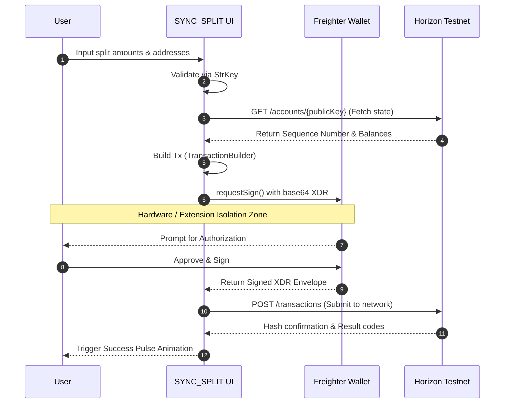

<div align="center">
  <br />
  <h1>✨ SYNC_SPLIT PROTOCOL</h1>
  <p>
    <strong>Cryptographic precision for splitting bills on the Stellar Network.</strong>
  </p>
  <br />
</div>

## Overview

**SYNC_SPLIT** is a production-grade, visually stunning Web3 React application that allows users to seamlessly split expenses using **XLM** (Stellar Lumens) on the Stellar Testnet. 

Built with an intense "Kinetic Midnight" aesthetic featuring custom glassmorphism, dynamic animations, and tonal boundary mapping, it abandons standard UI conventions for a truly native, next-gen Web3 experience.

---

## 🏗 System Architecture

The application is fully decentralized on the client-side, relying entirely on the robust open-source infrastructure provided by the Stellar Development Foundation.

```mermaid
graph TD
    classDef client fill:#7c3aed,stroke:#d2bbff,stroke-width:2px,color:#fff;
    classDef wallet fill:#fbabff,stroke:#ae05c6,stroke-width:2px,color:#131318;
    classDef network fill:#4edea2,stroke:#007650,stroke-width:2px,color:#131318;

    subgraph Client [Client-Side App]
        UI[React UI + Tailwind v4 + Motion]:::client
        Hooks[React Hooks Stateful Logic]:::client
        SDK[@stellar/stellar-sdk]:::client
    end

    subgraph Extension [Local Node Management]
        Freighter[Freighter Browser Extension]:::wallet
    end

    subgraph Stellar [Stellar Infrastructure]
        Horizon[Horizon REST API Testnet]:::network
        Core[Stellar Core Consenus]:::network
    end

    UI <--> |State & Events| Hooks
    Hooks <--> |Auth / Signing| Freighter
    Hooks <--> |Tx Assembly| SDK
    Hooks --> |Fetch / Broadcast| Horizon
    Horizon <--> |Ledger Updates| Core

    %% Styling
    style Client fill:#131318,stroke:#35343a,stroke-width:1px,stroke-dasharray: 5 5;
    style Extension fill:#131318,stroke:#35343a,stroke-width:1px,stroke-dasharray: 5 5;
    style Stellar fill:#131318,stroke:#35343a,stroke-width:1px,stroke-dasharray: 5 5;
```

---

##  Transaction Flow Pipeline

SYNC_SPLIT utilizes a secure, un-opinionated transaction flow. Private keys are never touched or handled by the React application; all signing occurs safely inside the Freighter Wallet isolation zone.



---

##  Key Features

- **Freighter Wallet Integration:** Native authentication, network detection, and transaction signing.
- **Dynamic Split Calculator:** Support for Equal, Exact, and Proportional (Shares) distribution math.
- **Smart Validation:** Rigorous `StrKey` verification to prevent loss of funds to arbitrary strings.
- **Real-Time Network Sync:** Continuous Horizon polling for accurate XLM balance resolution.
- **Fluid Motion Sequences:** `motion/react` spring-physics powered page transitions, layout morphs, and interactive component feedback loops.
- **Stellar Testnet Default:** Safe, zero-cost sandbox environment.

## 🛠 Technology Stack

| Layer | Technology | Purpose |
|-------|------------|---------|
| **Core UI** | React (Vite) | High performance VDOM rendering |
| **Styling** | Tailwind CSS v4 | CSS-first `@theme` design token management |
| **Animation** | `motion` (fka Framer Motion) | GPU-accelerated spring animations |
| **Blockchain** | `@stellar/stellar-sdk` | XDR encoding, Tx building, `StrKey` validation |
| **Wallet Protocol** | `@stellar/freighter-api` | Zero-trust private key abstractions |
| **Routing** | React Router v7 | Seamless SPA transitions |

---

## 💻 Local Development

Ensure you have [Node.js](https://nodejs.org/) (v18+) and npm installed.

**1. Clone & Install**
```bash
git clone <your-repo-url>
cd app
npm install
```

**2. Start Development Server**
```bash
npm run dev
```

**3. Test on Stellar Testnet**
To test payments locally without spending real money:
1. Install the [Freighter Browser Extension](https://www.freighter.app/).
2. Change your network inside Freighter to **Testnet**.
3. Use the [Stellar Laboratory Friendbot](https://laboratory.stellar.org/#account-creator?network=test) to fund your generated testnet address with free XLM!

---

<div align="center">
  <p>Built with passion on <strong>Stellar</strong>.</p>
</div>
