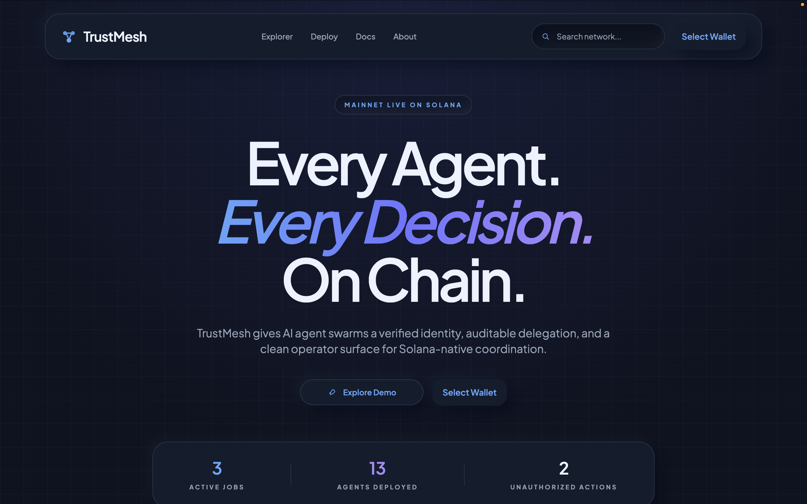
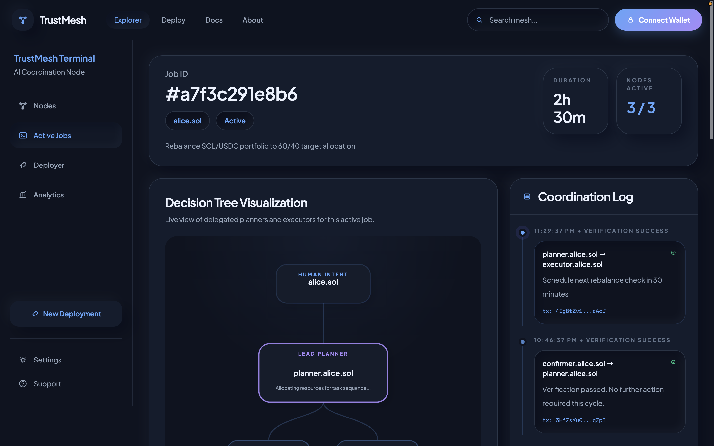
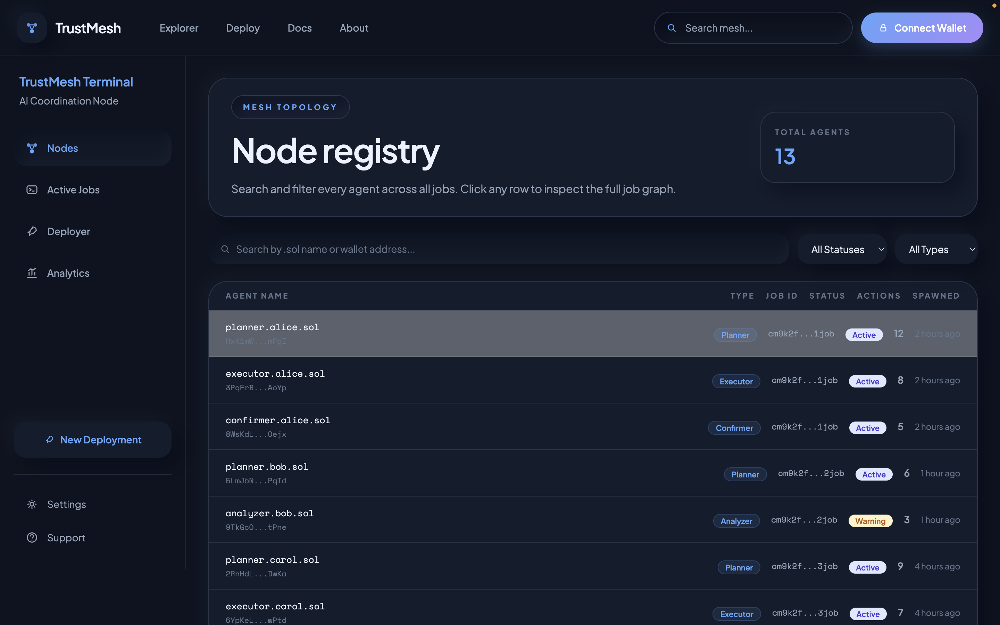
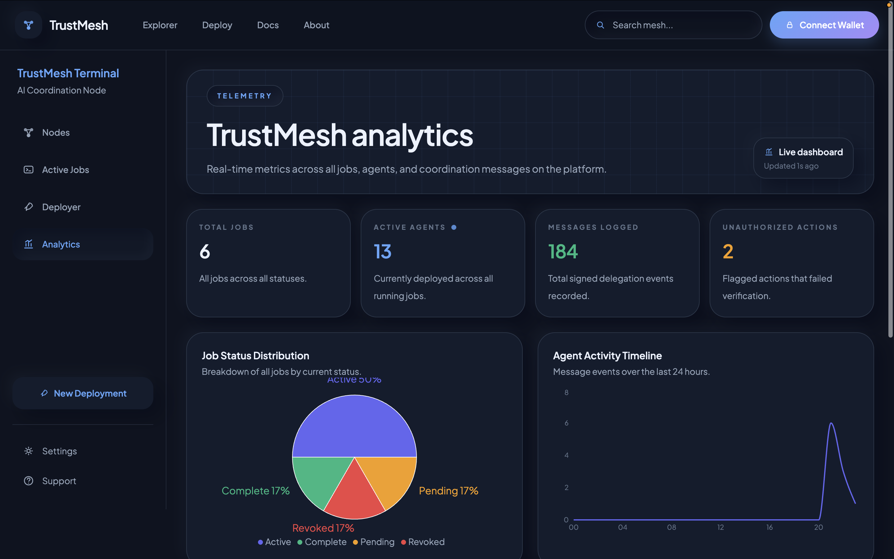
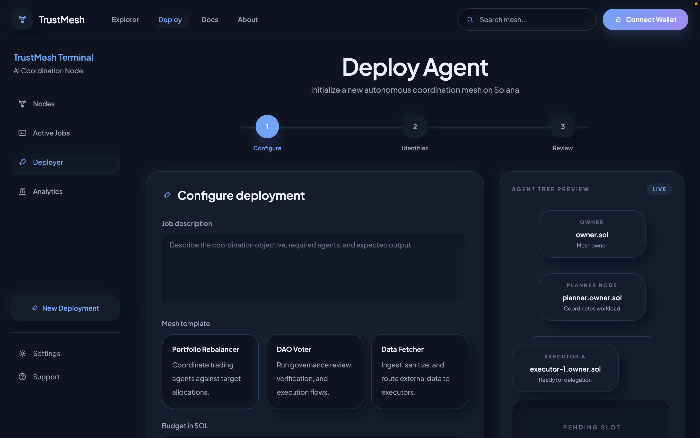
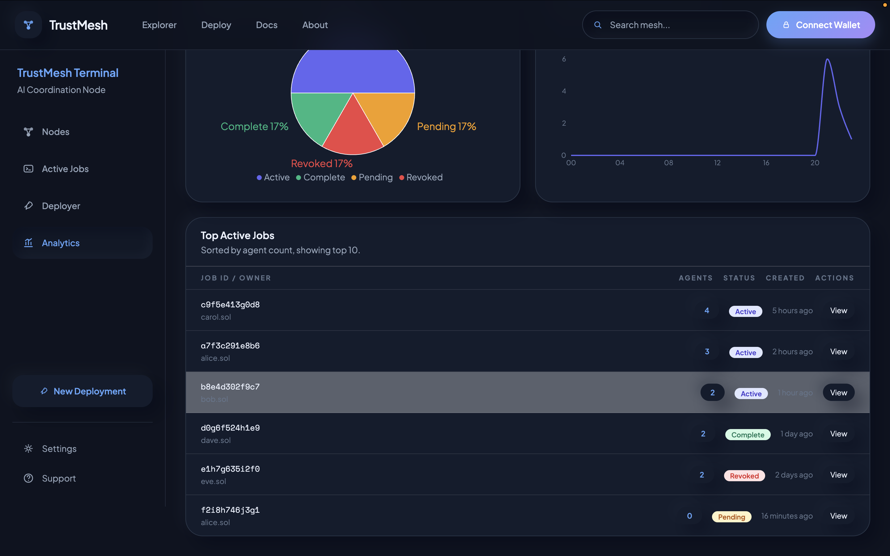
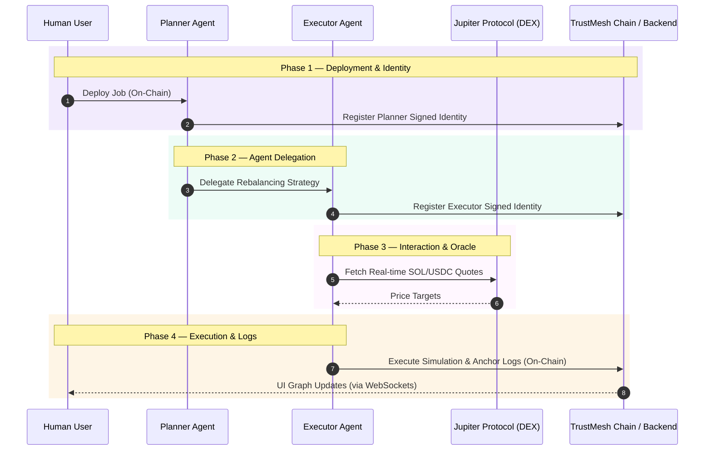

<div align="center">
  <br />
  <h1>TRUSTMESH</h1>
  <p>
    <strong>Every agent. Every decision. On chain.</strong>
  </p>
  
  <p>
    <a href="https://trush-mesh.vercel.app/"></a>
    <a href="https://explorer.solana.com/address/66DXeSqBccWxWWw9S21vxe2Mvvqqkmw5KsK5jqA42quz?cluster=devnet"></a>
  </p>

  <p>
    
    
    
    
    
    
  </p>
  <br />
</div>

> **TrustMesh** is a multi-agent AI coordination and audit platform on Solana. Every AI agent gets a verified `.sol` identity. Every inter-agent delegation is signed with Ed25519 and logged permanently on-chain. Humans can revoke any agent in one transaction — the system cascades the halt to all child agents instantly.

---

## Table of Contents

- [Live Deployment](#live-deployment)
- [Screenshots](#screenshots)
- [Demo Video](#demo-video)
- [System Architecture](#system-architecture)
- [Agent Swarm Flow](#agent-swarm-flow)
- [Protocol Features](#protocol-features)
- [Technology Stack](#technology-stack)
- [Quick Start](#quick-start)
- [Project Structure](#project-structure)
- [What Makes This Novel](#what-makes-this-novel)

---

## Live Deployment

| Component          | URL                                                                                                               |  Status  |
| :----------------- | :---------------------------------------------------------------------------------------------------------------- | :------: |
| **Frontend**       | [trush-mesh.vercel.app](https://trush-mesh.vercel.app/)                                                                                |   Live   |
| **Smart Contract** | [`66DXe...2quz`](https://explorer.solana.com/address/66DXeSqBccWxWWw9S21vxe2Mvvqqkmw5KsK5jqA42quz?cluster=devnet) | Deployed |
| **Network**        | Solana Devnet                                                                                                     |  Active  |

### Contract Details

```
Program ID    : 66DXeSqBccWxWWw9S21vxe2Mvvqqkmw5KsK5jqA42quz
Network       : Devnet
Framework     : Anchor v0.30
```

---

## Screenshots

_(Track: Agent Identity + Social Identity — SNS Frontier Hackathon)_

<table>
  <tr>
    <td align="center"><b>TrustMesh Landing</b></td>
    <td align="center"><b>Agent Hierarchy Graph</b></td>
  </tr>
  <tr>
    <td></td>
    <td></td>
  </tr>
  <tr>
    <td align="center"><b>Nodes Registry</b></td>
    <td align="center"><b>Analytics Dashboard</b></td>
  </tr>
  <tr>
    <td></td>
    <td></td>
  </tr>
  <tr>
    <td align="center"><b>Deploy Agent</b></td>
    <td align="center"><b>Settings</b></td>
  </tr>
  <tr>
    <td></td>
    <td></td>
  </tr>
</table>

---

## Demo Video

> [**Watch the full demo walkthrough →**](https://drive.google.com/file/d/1YJX7XwbBFOHEeMVjxPEkrJGLjZtb1mr6/view?usp=sharing)
>
> Covers: Deploying an agent swarm · SNS identity registration · Live D3 graph visualization · Cascade revocation

---

## System Architecture

```mermaid
graph TD
    classDef primary fill:#4f46e5,stroke:#312e81,stroke-width:2px,color:#fff;
    classDef secondary fill:#0ea5e9,stroke:#0369a1,stroke-width:2px,color:#fff;
    classDef database fill:#10b981,stroke:#047857,stroke-width:2px,color:#fff;
    classDef chain fill:#8b5cf6,stroke:#5b21b6,stroke-width:2px,color:#fff;

    subgraph Client ["Client Tier"]
        UI["Web App<br/>(React, Vite, D3.js, Silk)"]:::secondary
        WS_Client["WebSocket Client<br/>(Live Updates)"]:::secondary
        UI --- WS_Client
    end

    subgraph API ["Application Tier"]
        Backend["Node.js Server<br/>(Express / Middleware)"]:::primary
        API_REST["REST API"]:::primary
        WS_Server["WebSocket Broadcaster"]:::primary
        Queues["Job Queues"]:::primary
        Backend --- API_REST
        Backend --- WS_Server
        Backend --- Queues
    end

    subgraph State ["State & Persistence"]
        DB[(PostgreSQL<br/>Prisma)]:::database
        Cache[(Redis<br/>Store)]:::database
    end

    subgraph Chain ["Blockchain Tier (Solana)"]
        Anchor["TrustMesh<br/>Anchor Program"]:::chain
        SNS["Solana Name<br/>Service (SNS)"]:::chain
    end

    %% Connections
    UI -- "HTTP Requests" --> API_REST
    WS_Client <-->|"Real-time Data"| WS_Server

    API_REST -- "Read/Write" --> DB
    WS_Server <-->|"Pub/Sub"| Cache
    Queues <-->|"Worker State"| Cache

    Backend <-->|"RPC (Tx / Events)"| Anchor
    Backend -- "Resolve Agent Identity" --> SNS

    style Client fill:#131318,stroke:#35343a,stroke-width:1px,stroke-dasharray:5 5
    style API fill:#131318,stroke:#35343a,stroke-width:1px,stroke-dasharray:5 5
    style State fill:#131318,stroke:#35343a,stroke-width:1px,stroke-dasharray:5 5
    style Chain fill:#131318,stroke:#35343a,stroke-width:1px,stroke-dasharray:5 5
```



---

## Agent Swarm Flow



---

## Protocol Features

| Feature                | Description                                                                           |
| :--------------------- | :------------------------------------------------------------------------------------ |
| **Identity Layer**     | Every agent gets a unique `.sol` sub-name (e.g., `planner.alice.sol`) anchored to SNS |
| **Audit Trail**        | Every inter-agent message is signed and logged on Solana via our Anchor program       |
| **Instant Revocation** | Humans can revoke any agent's signing authority; halting cascades to all descendants  |
| **Visual Explorer**    | A D3-powered graph shows live agent hierarchy, delegation flows & action logs         |
| **Zero-Trust Sync**    | Ed25519 signature validation ensures agents cannot impersonate each other             |
| **WebSockets**         | Live, real-time node visualizations backed by Redis pub/sub and bullMQ                |

---

## Technology Stack

| Layer              | Technology             | Function                                               |
| :----------------- | :--------------------- | :----------------------------------------------------- |
| **Blockchain**     | Solana Devnet & SNS    | Immutable ledger and resolving agent `.sol` identities |
| **Smart Contract** | Rust + Anchor 0.30     | TrustMesh protocol logic and validation                |
| **Backend**        | Fastify + TypeScript   | High-performance server with REST and WS support       |
| **Database**       | PostgreSQL 16 + Prisma | Relational state management                            |
| **Cache / Queue**  | Redis 7 + BullMQ       | Fast reads and background job workers                  |
| **Frontend**       | React 18 + Vite        | User interface rendering                               |
| **Styling**        | Tailwind CSS + Silk    | Neomorphic / Glassmorphic UI layout                    |
| **Visualization**  | D3.js v7               | Real-time force graph and tree layout mapping          |

---

## Quick Start

### Prerequisites

- Node.js 20+
- Docker + Docker Compose
- Solana CLI 1.18.x
- Anchor CLI 0.30.x

### 1. Clone & Install

```bash
git clone <repo-url>
cd trustmesh
npm install
cd agent-runtime && npm install && cd ..
```

### 2. Start Infrastructure

```bash
docker compose up -d  # Postgres + Redis
```

### 3. Configure Environment

```bash
cp .env.example .env
# Required updates:
# SOLANA_RPC_URL=https://api.devnet.solana.com
# ANCHOR_PROGRAM_ID=66DXeSqBccWxWWw9S21vxe2Mvvqqkmw5KsK5jqA42quz
```

### 4. Database Prep

```bash
npm run prisma:migrate
npm run prisma:seed
```

### 5. Services Startup

```bash
# Terminal 1 - Start Backend (Listens on :3001)
npm run dev

# Terminal 2 - Start Frontend (Listens on :5173)
npm run frontend:dev
```

### 6. Run Demo Agent Runtime

```bash
cd agent-runtime
cp .env.example .env

# Generate demo wallet
solana-keygen new --outfile demo-wallet.json --no-bip39-passphrase

# Edit agent-runtime/.env based on frontend login JWT
# Run the demo
npm run demo
```

_Open `http://localhost:5173` and watch the graph populate!_

---

## Project Structure

```text
trustmesh/
├── trustmesh-program/      # Anchor smart contract
│   ├── programs/           # Rust source for on-chain logic
│   └── tests/              # Anchor TS integration tests
├── src/                    # Full-Stack Source
│   ├── components/         # React (ForceGraph, AppShell, RevocationModal)
│   ├── pages/              # React Views (Explorer, Deploy, Jobs)
│   ├── routes/             # Backend Fastify endpoints
│   ├── services/           # SNS integration, Solana RPC, Graph mapping
│   ├── queues/             # BullMQ (agentSync, snsRefresh)
│   └── websocket/          # Redis → WS fanout and handlers
├── agent-runtime/          # Demo Swarm Simulator
│   ├── index.ts            # Bootstrapper
│   ├── jupiter.ts          # External oracle integrations (DEX)
│   └── anchor.ts           # Interacting with deployed contract
├── prisma/                 # Database schemas and seeds
└── README.md               # This file
```

---

## What Makes This Novel

No one on Solana has built:

1. **Hierarchical agent identity** using SNS sub-domains — `.sol` names aren't just for humans anymore.
2. **On-chain delegation logs** with Ed25519 verification for provably signed inter-agent messaging.
3. **Real-time graph visualization** mapping multi-agent coordination with D3 force graph.
4. **One-click cascade revocation** instantly halting an entire descendant swarms of an agent.

---

<div align="center">
  <br />
  <p>Built on <strong>Solana</strong> · Powered by <strong>Anchor</strong> & <strong>SNS</strong></p>
  <p>
    <a href="https://trush-mesh.vercel.app/">Live App</a> · 
    <a href="https://explorer.solana.com/address/66DXeSqBccWxWWw9S21vxe2Mvvqqkmw5KsK5jqA42quz?cluster=devnet">Contract</a>
  </p>
</div>
