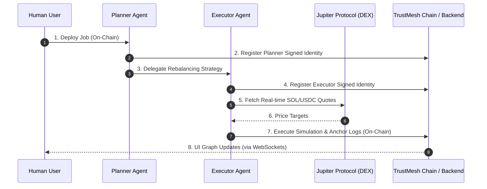

# TrustMesh Agent Runtime

Simulates a two-agent swarm executing a portfolio rebalancing job on Solana Devnet.

## Setup

1. Copy `.env.example` to `.env`
2. Generate a Devnet wallet: `solana-keygen new --outfile wallet.json`
3. Set `HUMAN_WALLET_KEYPAIR_PATH=./wallet.json`
4. Log in to TrustMesh frontend at `http://localhost:5173`
5. Copy JWT from browser DevTools → Application → Local Storage → `trustmesh_jwt`
6. Paste into `BACKEND_JWT` in `.env`
7. Run: `npm install && npm run demo`

## What It Does

- Spawns Planner + Executor agents on-chain
- Fetches real SOL/USDC price from Jupiter
- Simulates a swap with signed delegation messages
- Posts all actions to the backend so the frontend graph updates in real time

### Agent Swarm Flow

## Repo Notes

- This backend currently creates planner/executor rows during `POST /jobs`, so the runtime reconciles those rows instead of calling a missing `POST /agents` route.
- The checked-in app IDL omits instruction definitions, so the runtime augments the imported IDL locally from the on-chain program source.
- The current repo verifies backend message signatures over raw action text, while the Solana program verifies `sha256(action)`. The runtime signs both forms so each side can validate successfully.

## Troubleshooting

- `ONCHAIN_MISMATCH`: confirm `ANCHOR_PROGRAM_ID` matches the deployed Devnet program and that the backend is pointing at the same cluster.
- `SNS_RESOLUTION_FAILED`: the backend could not resolve `planner.<your-name>.sol` or `executor.<your-name>.sol`.
- `INVALID_SIGNATURE`: the `.sol` name resolved to a different wallet than the signer used by the runtime.
- Airdrop failures on Devnet are retried once after 10 seconds.

## Output

Watch the terminal for sequential logs and Solana Explorer links.
Open `http://localhost:5173/jobs/<jobId>` to see the live graph.
